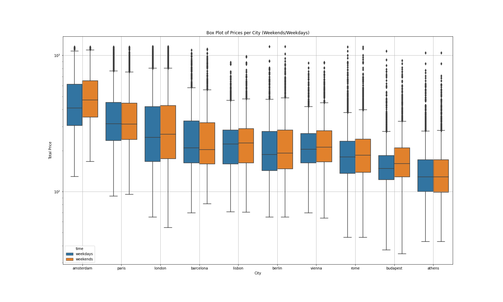

# Project of Data Visualization (COM-480)

| Student's name | SCIPER |
| -------------- | ------ |
| Kelyan Hangard | 312936 |
| Pierre Hellich | 316491 |
| Gaston Wolfart | 311916 |

[Milestone 1](#milestone-1) • [Milestone 2](#milestone-2) • [Milestone 3](#milestone-3)

## Milestone 1 (Friday 7th April, 5pm)

**10% of the final grade**

This is a preliminary milestone to let you set up goals for your final project and assess the feasibility of your ideas.
Please, fill the following sections about your project.

*(max. 2000 characters per section)*

### Dataset

We found the dataset on Kaggle (posted Ferbruary 2023). The data was already pre-processed as it comes from the study "Determinants of Airbnb prices in European cities: A spatial econometrics approach (Supplementary Material)" released in January 13, 2021. So there was no duplicates nor missing values. Only noticable point, a very few number of Airbnb was very expensive, so we considered them as outliers and we removed the 1% more expensive in order not to crush our graphs. 

There was two files by city : one for weekend and the other for weekdays. We created a bigger dataframe by concatenating all files and adding two columns CITY and TIME.

### Problematic

Airbnb is a service that permits individuals to rent their appartement to others for short duration, usually for vacation.

Our goal is to have a visualization that will help the user and guide him to find the perfect vacation spot. The visualization will focus on getting an overview of all the housing options and what they have to offer in terms of price, cleanliness, location and so on. <!-- We will also analyse and visualize the hidden correlates that affect the prices and the experiences of previous tenants. : selon si kelyan arrive a les normaliser et les rendres plus intiutives/logiques -->

However, Airbnb is not only for people seeking to rent a place for the holidays but also for people wanting to make money by leasing their home while they’re away. With this in mind, our visualization will include a way to get lessors to choose the right price range for their location and get an overview of what other people offer to compare.

### Exploratory Data Analysis

### Related work

As this dataset was released publicly two months ago, there is only a few data analysis and visualization done. The work mostly consists of : 

- Box plots and histogram of price density for each city 
- Hexbin plot with distributions of Price vs Distance to center
- Box plot and histogram of nb related person capacity, cleanliness rating, bedrooms, overall rating, distance to the center and distance to the metro (all destinations included)
- Regression on the same features in function of the price (all destinations included)
- Correlation matrix between all these features to determine the redundant one

Our original approach is to design a website to visualize these data in a ludic and interactive way. We could reshape our graph in a more expressive way to understand the order of magnitude at the first look. Somes of our ideas are : 

- Parallel coordinates for all our features (one line for each city)
- Recursive subdivision for nb of airbnb by city
- Geometry distorsion (or the same graph as in Every noise at once) across european cities regarding prices or another feature

We don’t have a lot of sources of inspiration. However we could cite the examples shown during the class, and some of the notebook already released concerning this dataset gave us the first keys to understand which insights in data could be relevant to explore and then to show. 

## Milestone 2 (5th May, 5pm)

**10% of the final grade**

## Milestone 3 (2nd June, 5pm)

**80% of the final grade**

## Late policy

- < 24h: 80% of the grade for the milestone
- < 48h: 70% of the grade for the milestone

