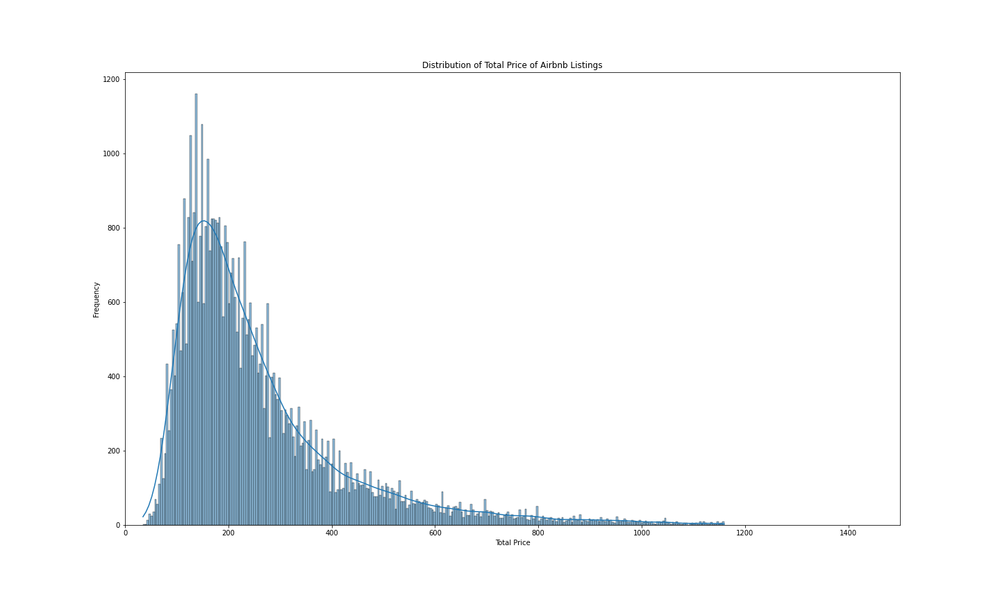
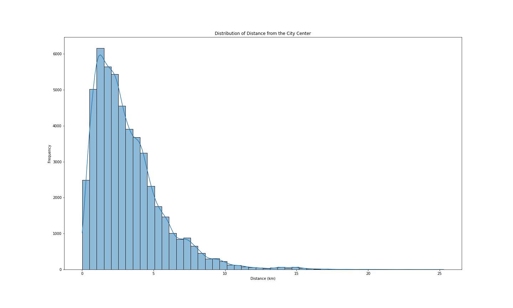
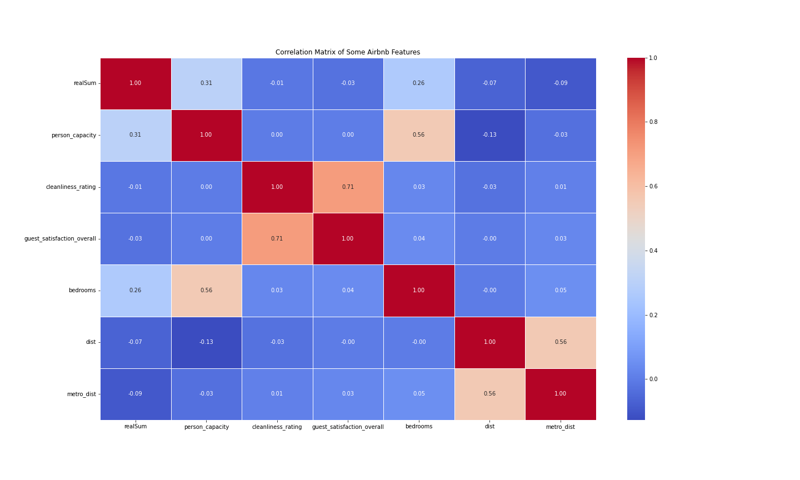

# Project of Data Visualization (COM-480)

| Student's name | SCIPER |
| -------------- | ------ |
| Kelyan Hangard | 312936 |
| Pierre Hellich | 316491 |
| Gaston Wolfart | 311916 |

## Visualization Website: [Click here to visit the website](https://com-480-data-visualization.github.io/project-2023-les-zinzins/website/)

[Milestone 1](#milestone-1-friday-7th-april-5pm) • [Milestone 2](#milestone-2-5th-may-5pm) • [Milestone 3](#milestone-3-2nd-june-5pm)

**For milestone 2, see pdf called "milestone2"**

## Milestone 1 (Friday 7th April, 5pm)

**10% of the final grade**

This is a preliminary milestone to let you set up goals for your final project and assess the feasibility of your ideas.
Please, fill the following sections about your project.

*(max. 2000 characters per section)*

### Dataset

We found the dataset on [Kaggle](https://www.kaggle.com/datasets/thedevastator/airbnb-prices-in-european-cities) (posted Ferbruary 2023). The data was already pre-processed as it comes from the study ["Determinants of Airbnb prices in European cities: A spatial econometrics approach (Supplementary Material)"](https://zenodo.org/record/4446043#.ZC7bqnZBzEZ) released in January 13, 2021. So there was no duplicates nor missing values. One noticable point was that a very small fraction of the housings were very expensive, so we considered them as outliers and removed the 1% most costly ones in order not to crush our graphs.

There were two files by city : one for weekend and the other for weekdays. We created a bigger dataframe by concatenating all files and adding two columns *CITY* and *TIME*.

### Problematic

Airbnb is a service that permits individuals to rent their appartement to others for a short duration, usually for vacation.

Our goal is to have a visualization that will help the user and guide him to find the perfect vacation spot. The visualization will focus on getting an overview of all the housing options and what they offer in terms of price, cleanliness, location and so on.

However, Airbnb is not only for people seeking to rent a place for the holidays but also for people wanting to make money by leasing their home while they're away. With this in mind, our visualization will include a way to get lessors to choose the right price range for their location and get an overview of what other people offer to compare.

### Exploratory Data Analysis

As you can see in this first graphic, the distribution of total prices in our dataset is heavy-tailed. This indicates that, while the majority of Airbnb listings are priced between 100 and 300 €, there are still a significant number of listings with higher prices. It is important to consider these higher-priced listings when analyzing the data, as they may provide valuable insights into luxury accommodations or unique property types that are available for rent.

The distribution of distances from the city center is also heavy-tailed, with most housings located within 5 km of the city center. This implies that a majority of listings offer convenient access to popular attractions, restaurants, and cultural sites, which is what travelers look for. 

From the box plot, we can observe significant gaps in prices across cities. For instance, the median price of an Airbnb in Amsterdam is around three times higher than in Athens. This shows the price variations between different destinations and can influence the travelers’ choice of city based on their budget. In addition, we can see that most cities have higher prices during weekends. There are however, some notable exceptions to this trend, such as Paris and Athens, where prices remain close regardless of whether it's a weekend or a weekday. Barcelona presents a interesting case, as it has higher prices during weekdays compared to weekends.

From the correlation matrix, it is interesting to observe a strong correlation between guest satisfaction and cleanliness rating. This finding suggests that guests value cleanliness as an essential factor contributing to their overall satisfaction. This is an expected result but the correlation matrix also highlights that the most significant influence on price is the person capacity. Interestingly, the price is negatively correlated with guest satisfaction. This observation indicates that higher-priced accommodations do not necessarily guarantee a better guest experience. 

### Related work

As this dataset was released publicly two months ago, there is only a few data analysis and visualization done. The work mostly consists of : 

- Box plots and histogram of price density for each city 
- Hexbin plot with distributions of Price vs Distance to center
- Box plot and histogram of nb related person capacity, cleanliness rating, bedrooms, overall rating, distance to the center, and distance to the metro (all destinations included)
- Regression on the same features as a function of the price (all destinations included)
- Correlation matrix between all these features to determine the redundant one

Our original approach is to design a website to visualize these data in a ludic and interactive way. We could reshape our graph in a more expressive way to understand the order of magnitude at a first glance. Some of our ideas are : 

- Parallel coordinates for all our features (one line for each city)
- Recursive subdivision for nb of Airbnb by city
- Geometry distortion (or the same graph as in Every noise at once) across European cities regarding prices or another feature

We don’t have a lot of sources of inspiration. However we could cite the examples shown during the class, and some of the notebooks already released concerning this dataset gave us the first keys to understanding which insights in data could be relevant to explore and then show. 

## Milestone 2 (5th May, 5pm)

**See pdf called [milestone2.pdf](https://github.com/com-480-data-visualization/project-2023-les-zinzins/blob/master/milestone2.pdf)**

## Milestone 3 (2nd June, 5pm)

**See pdf called [???]**
**See presentation video called [Airbnb explorer tool](./Airbnb_explorer_tool.mp4)**

### Usage

#### Webpage  structure

Our visualization has 1 presentation part, and 4 visualization stages. You can navigate these different stages in three simple ways:
1. Use the house on the left as a navigation bar. You can see the categories by hovering over the different rooms, and go to them by clicking.
2. Use the floating arrow buttons on the bottom right of the screen to go to the next section.
3. Or simply scroll up or down !

For each category there is a (?) sign next to the title of the section to indicate how to use the current visualization.

#### Prices overview

- Observe the slight changes in the violin shapes when switching between the weekend and weekday views
- You can explore the visualization using several options. Hovering over a violin shape displays comprehensive statistical insights associated with that city
- Double-clicking adjusts the zoom level from default to a view that accommodates all data
- Try selecting a horizontal range to focus on a specific city
- Selecting a vertical range can enhance the visibility of the violin shapes for all cities around a chosen price value

#### Location overview

- Hovering over a point reveals its exact value
- Try deselecting one of the two options to view either both distance metrics superimposed or just the distance to the metro more clearly

#### Capacity of the Airbnb

- Select a traveler category by using one of the radio buttons: Family (3-5 persons), Couple (2 persons), or Group (6 persons)
- The treemaps will be updated based on the selected category, displaying the best destinations in each category.
- Treemaps display the number of Airbnbs and the percentage of total Airbnbs in each capacity category
- Hover over a treemap category to view detailed information about the number of Airbnbs and the percentage of total Airbnbs.
- Click on a treemap category to see informations about this category bigger

#### Weather

You can see the number of sunny days in 2022 over the whole year with the surface of the yellow circles. If you hover your mouse over the city circles, a tooltip will appear, showing the average temperature over the year of 2022.

### Dependencies

#### Webpage  structure

- [Tippy](https://atomiks.github.io/tippyjs/) - A simple tooltip library

#### Prices overview

#### Location overview

#### Capacity of the Airbnb

- [Papa Parse](https://www.papaparse.com/) - A powerful CSV parsing library for JavaScript
- [Plotly.js](https://plotly.com/javascript/) - A JavaScript graphing library

#### Weather

- [D3.js](https://d3js.org/) - Data Driven Documents
- [TopoJSON](https://github.com/topojson/topojson) -  Extension of GeoJSON that encodes topology
- [d3-legend](https://d3-legend.susielu.com/) - A tool to help make legend for d3 scales

### Installation

1. Clone the repository or download the source code.
2. Make sure you have the latest version of a modern web browser installed (Chrome, Firefox, Safari, etc.).
3. Open the `index.html` file in a web browser.

### Code Explanation

#### Webpage  structure
A lot of effort has been put in having a nice navigation experience with the house and each room lighting up whenever you are in the corresponding section.

This effect has been made possible with the use of SVG and polygons drawn around each room of the house image. The script in `page_behavior.js` helps to update the navbar to match the current scroll position of the user. 

The scroll has been set to snap to each section so we have a nice separatioon and an overall nicer feel.

#### Prices overview

#### Location overview

#### Capacity of the Airbnb

The page uses the following main files:

- `index.html`: Includes the treemaps section, radio buttons for selecting the traveler category, and the necessary JavaScript and CSS files.

- `main.js`: This file contains the JavaScript code responsible for loading the CSV data, generating the treemaps, and handling the event listeners for the radio buttons. It uses the Papa Parse library to parse the CSV data and Plotly.js library to create the treemaps.

- `style.css`: This file contains the CSS styles for the web page, including the layout, positioning, and styling of the treemaps, radio buttons, and other elements.

The `generateTreemaps` function in `main.js` takes a list of cities as input. It loads CSV data from a file and filters it to obtain data specific to each city. It creates a treemap structure for each city using the filtered data, including labels, parents, values, and tooltips. It configures the appearance of the treemap markers based on the capacity type. The function also sets the layout options for the treemap. Finally, it renders the treemaps on the web page using the Plotly library. This process is repeated for each city in the provided list, generating multiple treemaps dynamically.

The `clearTreemaps` in `main.js` function is responsible for clearing the generated treemaps from the webpage. It iterates over an array of treemap IDs and performs the following actions for each ID:
    It removes the Plotly instance associated with the treemap, effectively clearing the treemap.
    It resets the CSS class of the treemap element, removing any applied styling.

Then the rest of the code in `main.js` adds event listeners to a group of radio buttons with the name "category". When a radio button's value changes, the event listener triggers a function that clears any existing treemaps and generates new treemaps based on the selected category. The specific cities for each category are predefined, and the generateTreemaps function is called with the appropriate cities based on the selected value.

#### Weather

For the weather map, D3.js was used extensively. We used a scale sqrt for the radius as we want the area (not the radius) to be proportionnal to the number of sunny days.

The tooltip is created with a high z-index to be placed on top when it is showed. It is always hidden except when the user passes it's mouse on a city ring. When this happens, we handle the drawing of the tooltip using callbacks of mouse events.

We get the data from the prepared dataset of the 2022 meteo archives and display a scatterplot.

